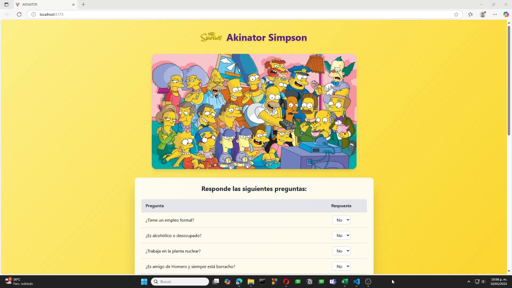
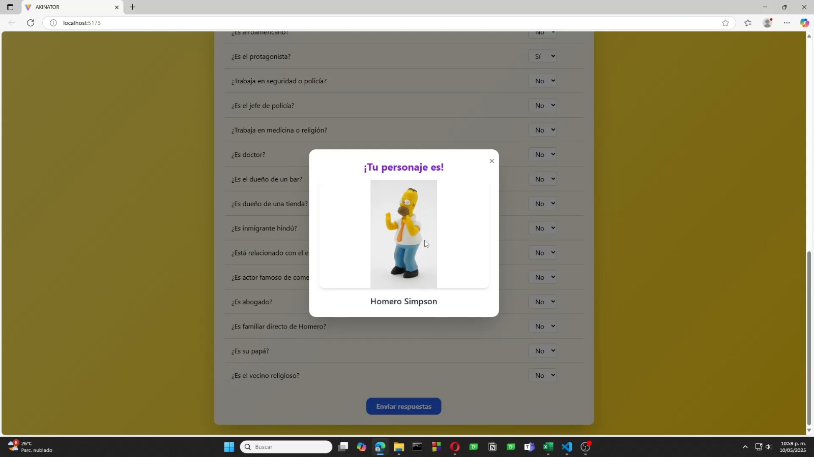
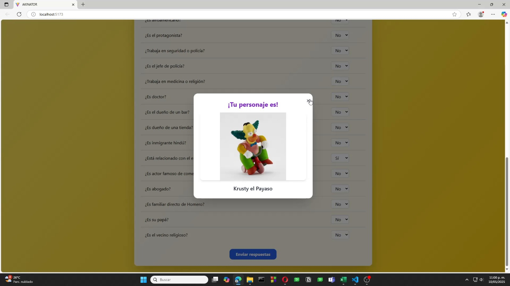

# Akinator de Los Simpsons con Redes Neuronales Artificiales (Brain.js + React + Firebase)
Proyecto escolar para evaluación de conocimiento sobre Redes Neuronales Arificiales.

Implementación de Red Neuronal Artificial para la predicción de personajes de Los Simpsons.

## DESCRIPCIÓN
Se usó React con Vite y Tailwind para la creación del frontend de este proyecto, implementando también la librería Brain.js,
la cual se uso para encontrar el personaje tomando en cuenta las respuestas del usuario al formulario proporcionado y entrenando
con patrones establecidos tomados de una base de datos en Firebase, obteniendo así predicciones de los personajes pensados.

## Imagenes del proyecto

### Interfaz

### 1

### 2

### 3
